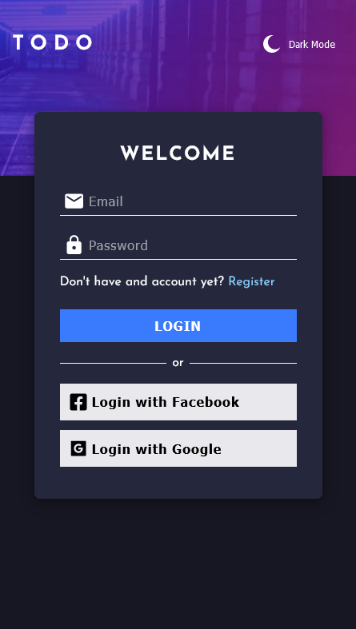
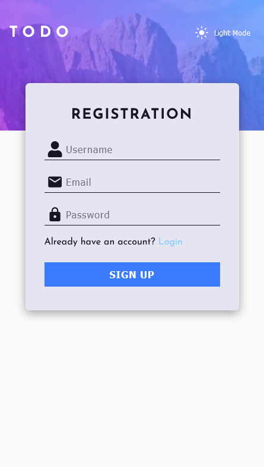
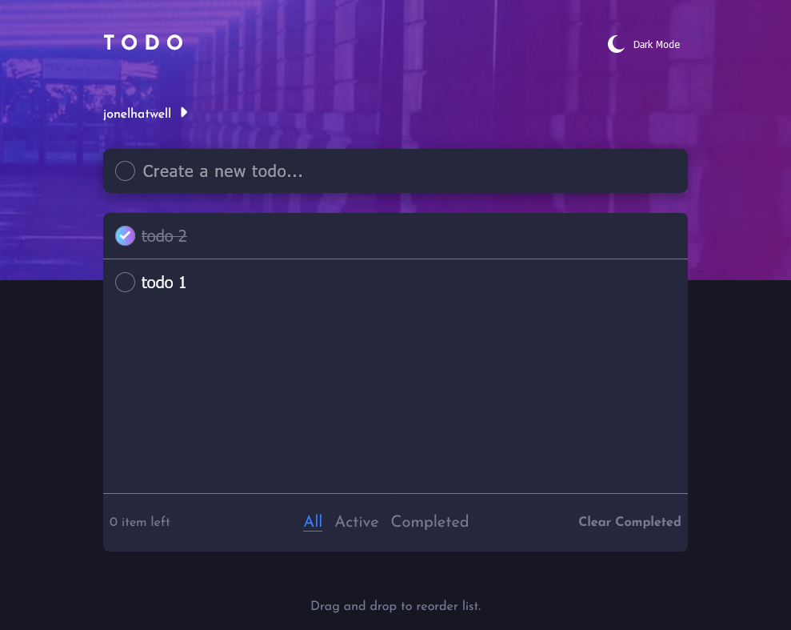

# Frontend Mentor - Todo app solution

This is a solution to the [Todo app challenge on Frontend Mentor](https://www.frontendmentor.io/challenges/todo-app-Su1_KokOW). Frontend Mentor challenges help you improve your coding skills by building realistic projects.

## Table of contents

- [Overview](#overview)
  - [Screenshot](#screenshot)
  - [Links](#links)
  - [Built with](#built-with)
  - [Useful resources](#useful-resources)
  - [Author](#author)

## Overview

### Screenshot

### Links

- Solution URL: [Frontendmentor](https://www.frontendmentor.io/solutions/firebase-105-reactjs-reactbeautifuldnd-scss-authentication-CCcmHt8VYk)
- Live Site URL: [https://react-80ff9.web.app/](https://react-80ff9.web.app/)

### Built with

- Mobile-first workflow
- [SCSS](https://sass-lang.com/) - CSS pre-processor
- [React](https://reactjs.org/) - JS library
- [Firebase](https://firebase.google.com/) - For saving data
- [react-beautiful-dnd](https://github.com/atlassian/react-beautiful-dnd) - For re-ordering list
- [Vite](https://vitejs.dev/) -  local development server

### Useful resources

- [react-beutiful-dnd](https://github.com/atlassian/react-beautiful-dnd) - this helped me to create dragable todo item.

- [React Router DOM](https://v5.reactrouter.com/web/guides/quick-start) - This Helped me to routes the page of the application.

- [Youtube Video about how to use react-beautiful-dnd](https://www.youtube.com/watch?v=aYZRRyukuIw&t=60s) - This video helped me to understand react-beatiful-dnd.

- [Youtube Video about how to use Sign-in With Google for firebase](https://www.youtube.com/watch?v=cZAnibwI9u8&t=1457s) - This video helped me to add the functionality of google sign-in for the application

- [Youtube Video about how to use Facebook Authentication for firebase](https://www.youtube.com/watch?v=kEfe9u5F_L0) - This video helped me to add the functionality of facebook sign-in for the application

- [Youtube Video about how to create email and password](https://www.youtube.com/watch?v=x62aBvnRCKw&list=PLaPfwr_iF3CarlXMRMsgF6w4htzDg5tvh&index=2) - This helped me to create the sign-up function for the application

## Author

- Frontend Mentor - [Jonel Hatwell](https://www.frontendmentor.io/profile/hatwell-jonel)
- LinkedIn - [Jonel Hatwell](https://www.linkedin.com/in/jonel-hatwell/)